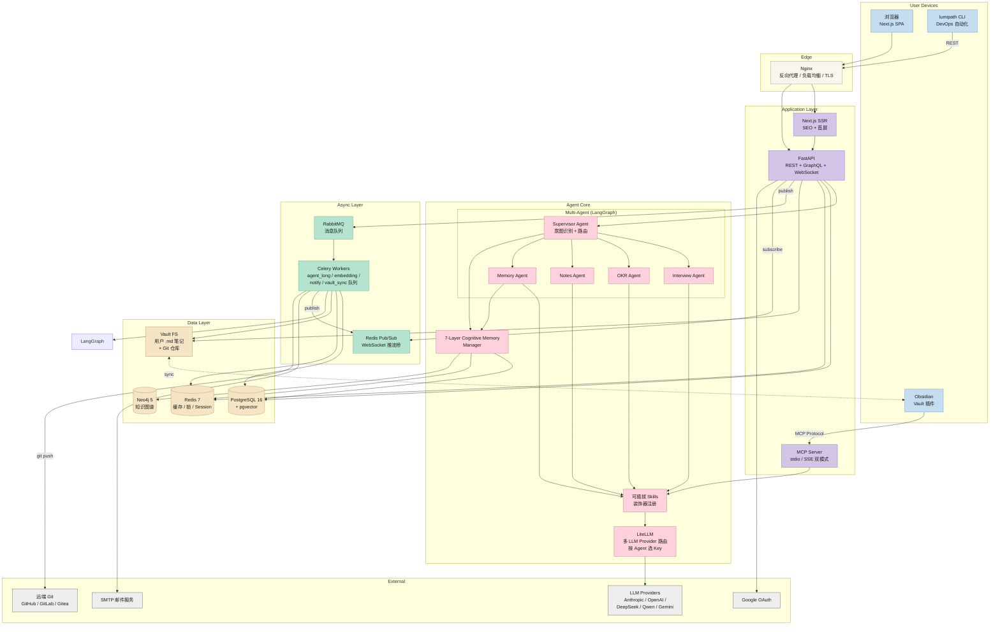
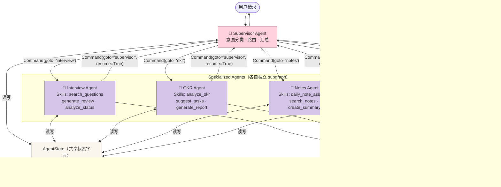
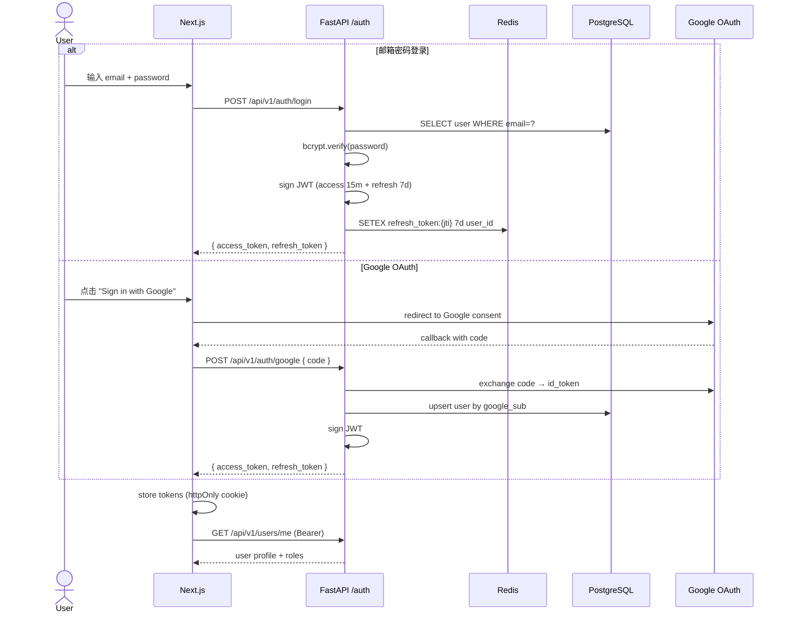
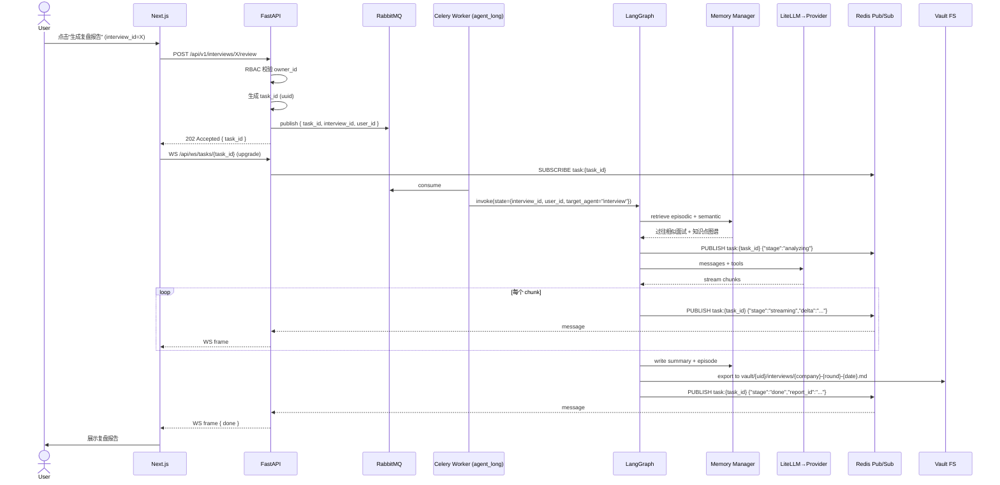
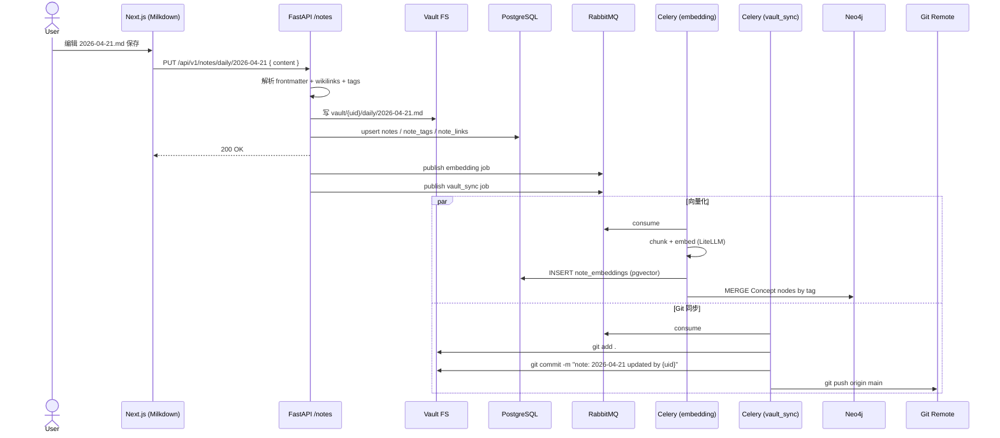
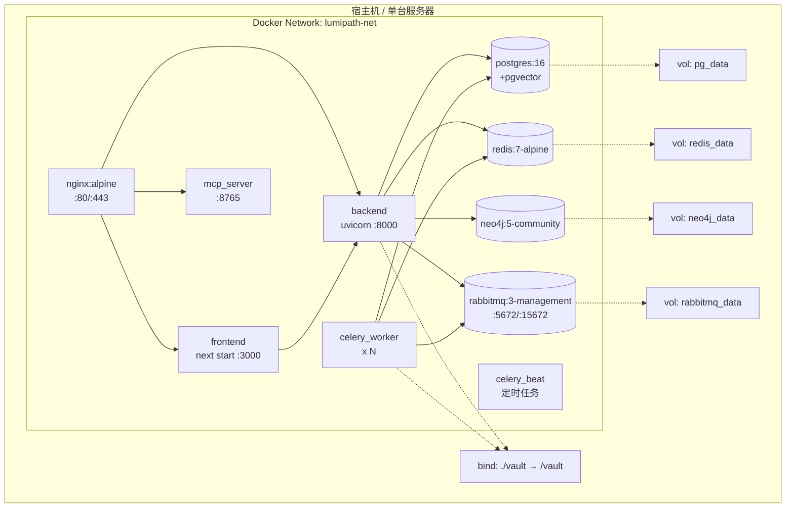

# LumiPath 系统架构文档

> Step 1 产出 · 只含架构设计与图示，代码实现见 Step 2+。
> 版本：v1.0 (2026-04-21)

---

## 1. 项目简介

**LumiPath** 是一个 AI 驱动的个人成长操作系统，围绕四大模块串起求职与学习闭环：

1. **面试追踪与复盘**（Interview Tracker）
2. **OKR 规划与每日打卡**（OKR Planner）
3. **每日学习笔记**（Markdown Vault，Obsidian 兼容 + Git 版本化）
4. **多用户与 RBAC 权限体系**

核心差异点：
- 不是"把 AI 拼进 CRM"，而是 **以 LangGraph Multi-Agent 为中枢** 的认知系统。
- 7 层 Cognitive Memory 让 Agent 记得住、会反思、能成长。
- **Markdown-first**：笔记数据永远在 `.md` 文件里，DB 只做索引，用户可随时用 Obsidian 直开。
- MCP Server 暴露所有能力，可被 Obsidian 插件 / Claude Desktop / Cursor 反向调用。

---

## 2. 架构总览（C4 Container Diagram）



---

## 3. 组件职责矩阵

| 组件 | 职责 | 技术 |
|------|------|------|
| **Nginx** | TLS 终止、静态资源、`/api` 反代、WebSocket 升级、限流 | Nginx |
| **Next.js SSR** | 首屏渲染、SEO、i18n（zh-CN / en-US） | Next 14 App Router |
| **FastAPI** | REST/GraphQL/WebSocket 入口、鉴权、编排 | FastAPI + Pydantic v2 |
| **MCP Server** | 向外部 AI 工具暴露标准化工具 | mcp SDK (Py) + stdio + SSE |
| **Supervisor Agent** | 用户意图识别、路由到专项 Agent、汇总最终回复 | LangGraph 0.2+ Supervisor 模式 |
| **Interview Agent** | 面试题目搜索、复盘报告生成、面试状态分析 | LangGraph subgraph |
| **OKR Agent** | OKR 进度分析、KR 拆解建议、每日任务生成 | LangGraph subgraph |
| **Notes Agent** | 笔记助手、语义检索、周/月摘要生成、概念提取 | LangGraph subgraph |
| **Memory Agent** | 跨层记忆检索（RRF）、Short-term→Long-term 固化、知识图谱更新 | LangGraph subgraph |
| **Skills** | 单一职责的可插拔能力（`search_questions`、`analyze_okr`、`daily_note_assistant` ...） | 自研 `BaseSkill` + `@register_skill` |
| **Memory Manager** | 7 层记忆统一读写接口 | 自研，见 [memory-system.md](memory-system.md) |
| **LiteLLM** | 统一多 LLM 供应商 SDK | LiteLLM |
| **RabbitMQ** | 异步任务 broker，按队列分流 | RabbitMQ 3.12+ |
| **Celery Workers** | 执行 Agent 长任务、向量化、发邮件、Git 提交 | Celery 5.3 |
| **Redis** | 缓存、Short-term Memory、分布式锁、Session、Pub/Sub | Redis 7 |
| **PostgreSQL** | 主数据、笔记元数据、向量存储 | PG 16 + pgvector |
| **Neo4j** | 个人知识图谱、Semantic Memory | Neo4j 5 Community |
| **Vault FS** | 用户 `.md` 笔记源文件 + 本地 Git 仓库 | 本地挂载 / S3 (未来) |
| **lumipath CLI** | DevOps 工具：`sync` / `push` / `init` / `export` | Python Click |

---

## 4. Multi-Agent 架构详解

### 4.1 Agent 拓扑（LangGraph Supervisor 模式）



### 4.2 Agent 内部节点（每个 subgraph 共用的节点模式）

每个 Specialized Agent 内部仍保持 5 节点标准流水线：

```
retriever → planner → executor → reflector → memory_writer
```

- `retriever`：调用 Memory Agent 或直接查 Redis/PG 加载上下文
- `planner`：结合上下文制定 Skill 调用计划
- `executor`：调用一个或多个 Skill，产出中间结果
- `reflector`：评估结果质量，若不满足预期则重新规划（最多 3 次）
- `memory_writer`：把本次执行的结果写回记忆层

### 4.3 Agent 间通信协议

| 层面 | 协议 | 说明 |
|------|------|------|
| Agent 内部节点 | **共享状态（State Passing）** | TypedDict 直接传递，无序列化开销 |
| Supervisor ↔ Specialized Agent | **LangGraph `Command` 对象** | `Command(goto="interview", update={...})` |
| Agent → 外部工具（MCP） | **MCP Protocol**（stdio / SSE） | Obsidian / Claude Desktop 调用 |
| 长任务触发 Agent | **AMQP**（RabbitMQ → Celery） | Celery worker `invoke(LangGraph)` |
| Agent 结果推前端 | **WebSocket**（经 Redis Pub/Sub） | 流式 delta 推送 |

### 4.4 Per-Agent API Key 路由

用户可在设置页为每个 Agent 独立指定 LLM Key，LiteLLM 在调用时按如下优先级选 Key：

```
agent_llm_assignments[user_id, agent_name]   ← 最高优先
    ↓ 未配置
user_llm_keys[user_id, provider, is_default=true]  ← 用户默认 Key
    ↓ 未配置
系统兜底 Key（环境变量）
```

典型使用场景：
- Notes Agent → DeepSeek（成本低，笔记摘要任务）
- Interview Agent → Claude Opus（质量高，复盘报告）
- OKR Agent → GPT-4o（用户偏好）
- Memory Agent → 任意（记忆检索不需要强推理）

数据库实现见 [database-schema.md](database-schema.md) `agent_llm_assignments` 表。

---

## 5. 关键请求链路（Sequence Diagrams）

### 5.1 用户登录（邮箱密码 / Google OAuth）



### 5.2 AI 生成面试复盘（长任务 + 异步 + 流式推送）



### 5.3 保存每日笔记 + 向量化 + Git 提交



---

## 6. 数据流总览（所有模块一张图）

```mermaid
flowchart LR
    subgraph FE [Frontend]
        UI[Next.js 页面]
        ED[Milkdown Editor]
    end

    subgraph API [API Layer]
        AUTH[/auth]
        INT[/interviews]
        OKR[/okr]
        NOTE[/notes]
        AG[/agent]
    end

    subgraph AGENT [Agent Core]
        GRAPH[LangGraph]
        SK[Skills Registry]
        MEM[Memory Manager]
    end

    subgraph STORE [Storage]
        PG[(PostgreSQL)]
        RD[(Redis)]
        N4J[(Neo4j)]
        VT[(Vault .md)]
    end

    subgraph ASYNC [Async]
        RMQ((RabbitMQ))
        CW[Celery]
    end

    UI --> AUTH
    UI --> INT
    UI --> OKR
    ED --> NOTE
    UI --> AG

    AUTH --> PG
    AUTH --> RD
    INT --> PG
    OKR --> PG
    NOTE --> VT
    NOTE --> PG
    AG --> GRAPH

    GRAPH --> SUP
    SUP --> IA2[Interview Agent]
    SUP --> OA2[OKR Agent]
    SUP --> NA2[Notes Agent]
    SUP --> MA2[Memory Agent]
    IA2 & OA2 & NA2 & MA2 --> SK
    GRAPH --> MEM
    MEM --> PG
    MEM --> RD
    MEM --> N4J

    NOTE --> RMQ
    INT --> RMQ
    GRAPH --> RMQ
    RMQ --> CW
    CW --> PG
    CW --> N4J
    CW --> VT
```

---

## 7. 部署视图（Docker Compose）



`docker-compose.yml`（规划，Step 3 实现）包含服务：
`nginx`, `frontend`, `backend`, `mcp_server`, `worker_agent`, `worker_embedding`, `worker_notify`, `worker_vault_sync`, `celery_beat`, `postgres`, `redis`, `neo4j`, `rabbitmq`。

---

## 8. 关键技术决策（与 [PLAN.md](../PLAN.md) 一致）

| 决策 | 选择 | 理由 |
|------|------|------|
| 关系库 | PostgreSQL + pgvector | jsonb 存动态字段；pgvector 省去独立向量库；并发更好 |
| 图库 | Neo4j | 图关系查询（"字节二面相关的 Redis 题"）Cypher 比向量准 |
| 队列 | RabbitMQ + Celery | 成熟、Celery 生态完善、运维简单；本项目不需要 Kafka 的 replay |
| LLM 层 | LiteLLM | 统一接口；用户自带 API Key；方便切模型 |
| 编辑器 | Milkdown | ProseMirror 内核，所见即所得但产出纯 Markdown |
| 认证 | JWT + Google OAuth | 成熟方案；Google 登录降低门槛 |
| Vault | 本地挂载 + Git | Obsidian 互通最自然；Git 提供版本化 + 跨设备同步 |

---

## 9. 可观测性（MVP+1 规划，不在 Step 2 范围）

- **日志**：结构化 JSON → Loki / Elastic
- **指标**：Prometheus exporter（FastAPI、Celery、RabbitMQ、PG）
- **追踪**：OpenTelemetry + Jaeger（Agent 多节点链路）
- **告警**：LLM 失败率、队列积压、WebSocket 断连

---

## 10. 扩展性与未来演进

| 方向 | 说明 |
|------|------|
| 水平扩展 | FastAPI 无状态；Celery worker 按队列独立扩缩容；PG 主从只读副本 |
| 多租户 | 当前用 `owner_id` 行级隔离；若 B 端化可考虑 schema-per-tenant |
| 云迁移 | 本地 Compose → 云 Compose（单机）→ K8s（Helm Chart）平滑演进 |
| Vault 分片 | 用户量大时 vault 目录按 `{uid}/` 天然分片；可挂 S3FS |
| Semantic Memory 升级 | Neo4j → 可换 AWS Neptune / JanusGraph |

---

## 11. 相关文档

- [PLAN.md](../PLAN.md) — 全局开发计划
- [docs/memory-system.md](memory-system.md) — 7 层 Cognitive Memory 规范
- [docs/notes-vault-spec.md](notes-vault-spec.md) — Markdown Vault 规范
- [docs/database-schema.md](database-schema.md) — 数据库 DDL + ER 图
