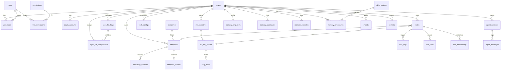

# LumiPath 数据库 Schema 设计

> Step 1 产出 · 完整 SQL DDL + ER 图 + Neo4j Schema + 索引策略。
> 目标库：**PostgreSQL 16 + pgvector 0.7+ + pgcrypto**；图数据库：**Neo4j 5**。
> 版本：v1.2 (2026-04-21)

---

## 0. 变更历史

### v1.2 (2026-04-21)
6. **Multi-Agent 架构**：新增 `agent_llm_assignments` 表，支持用户为 Supervisor / Interview / OKR / Notes / Memory 五个 Agent 各自绑定独立 LLM API Key。

### v1.1 变更说明（基于用户反馈）

1. **LLM API Key 独立成表** `user_llm_keys`（不再塞进 `users.llm_api_keys`），用户可随时删除单条凭据；支持同一 provider 多条 key、多 provider 并存。
2. **所有敏感字段统一用 pgcrypto 列加密**（`pgp_sym_encrypt` + 应用级 master key）：LLM API Key、OAuth access/refresh token、Git credentials。
3. **软删除策略明确**：核心资源表（`users` / `interviews` / `okr_objectives` / `okr_key_results` / `notes` / `vault_configs`）保留 `deleted_at`；关联/审计/快照类表物理删。
4. **多 embedding 模型并存**：`note_embeddings` / `memory_*` 的 `embedding` 向量表均带 `model_name` 列，HNSW 索引按 `(model_name)` 维度过滤查询。
5. **MVP 不做分区**：`events` / `agent_messages` / `memory_procedures` 单表，等数据量起来再切月分区。

---

## 1. 命名与约定

- 表名：snake_case 复数（`users`、`interview_questions`）
- 主键：`id UUID DEFAULT gen_random_uuid() PRIMARY KEY`
- 软删：`deleted_at TIMESTAMPTZ NULL`（仅核心资源表）
- 时间戳：`created_at` / `updated_at` 统一 `TIMESTAMPTZ DEFAULT now()`
- 乐观锁：关键可变资源带 `version INT DEFAULT 0`
- 外键：核心强关联 `ON DELETE CASCADE`，弱关联 `ON DELETE SET NULL`
- 字符集：UTF-8
- 扩展：`uuid-ossp`, `pgcrypto`, `vector`, `pg_trgm`, `citext`

### 1.1 加密约定（pgcrypto）

所有敏感列类型为 `BYTEA`，使用对称加密：

```sql
-- 写入
INSERT INTO user_llm_keys(..., api_key_encrypted)
VALUES (..., pgp_sym_encrypt(:plaintext, current_setting('app.master_key')));

-- 读出
SELECT pgp_sym_decrypt(api_key_encrypted, current_setting('app.master_key'))::text
FROM user_llm_keys WHERE ...;
```

- `app.master_key` 通过启动时 `SET LOCAL` 注入（由应用从环境变量 / KMS 加载），**永不持久化到 postgresql.conf**。
- Key 轮换方案：`app.master_key_prev` 兜底；后台任务逐条 `decrypt(prev) → encrypt(new)`。
- 不使用 pgcrypto 的原因（反例）：每次查询 SET 配置繁琐。本方案通过每连接 `SET LOCAL` 保证安全。

---

## 2. ER 图（高层）



---

## 3. 模块 1 · 用户与 RBAC（含 LLM Key 隔离表）

```sql
-- 扩展
CREATE EXTENSION IF NOT EXISTS "uuid-ossp";
CREATE EXTENSION IF NOT EXISTS pgcrypto;
CREATE EXTENSION IF NOT EXISTS vector;
CREATE EXTENSION IF NOT EXISTS pg_trgm;
CREATE EXTENSION IF NOT EXISTS citext;

-- 用户主表
CREATE TABLE users (
    id              UUID PRIMARY KEY DEFAULT gen_random_uuid(),
    email           CITEXT UNIQUE,
    phone           VARCHAR(32) UNIQUE,
    password_hash   VARCHAR(255),                   -- argon2；纯 OAuth 用户可空
    display_name    VARCHAR(64) NOT NULL,
    avatar_url      TEXT,
    locale          VARCHAR(8) DEFAULT 'zh-CN',     -- zh-CN / en-US
    status          VARCHAR(16) DEFAULT 'active',   -- active / suspended / deleted
    last_login_at   TIMESTAMPTZ,
    preferences     JSONB DEFAULT '{}'::jsonb,      -- UI 偏好、默认模型等非敏感
    version         INT DEFAULT 0,
    created_at      TIMESTAMPTZ DEFAULT now(),
    updated_at      TIMESTAMPTZ DEFAULT now(),
    deleted_at      TIMESTAMPTZ
);
CREATE INDEX idx_users_status ON users(status) WHERE deleted_at IS NULL;

-- OAuth 账户（Google / GitHub ...）
CREATE TABLE oauth_accounts (
    id                      UUID PRIMARY KEY DEFAULT gen_random_uuid(),
    user_id                 UUID NOT NULL REFERENCES users(id) ON DELETE CASCADE,
    provider                VARCHAR(32) NOT NULL,           -- google / github
    provider_sub            VARCHAR(128) NOT NULL,          -- provider 返回的 sub
    access_token_encrypted  BYTEA,                          -- pgp_sym_encrypt
    refresh_token_encrypted BYTEA,
    expires_at              TIMESTAMPTZ,
    raw_profile             JSONB,
    created_at              TIMESTAMPTZ DEFAULT now(),
    updated_at              TIMESTAMPTZ DEFAULT now(),
    UNIQUE (provider, provider_sub)
);
CREATE INDEX idx_oauth_user ON oauth_accounts(user_id);

-- 🆕 LLM API Key 独立表（用户可随时删除单条，不污染 users 表）
CREATE TABLE user_llm_keys (
    id                  UUID PRIMARY KEY DEFAULT gen_random_uuid(),
    user_id             UUID NOT NULL REFERENCES users(id) ON DELETE CASCADE,
    provider            VARCHAR(32) NOT NULL,               -- anthropic / openai / deepseek / qwen / gemini / ollama / custom
    key_alias           VARCHAR(64) NOT NULL,               -- 用户起的别名，如 "我的个人 Claude Key"
    api_key_encrypted   BYTEA NOT NULL,                     -- pgp_sym_encrypt(plaintext, master_key)
    key_last4           VARCHAR(4) NOT NULL,                -- 展示用：sk-...abcd
    base_url            VARCHAR(512),                       -- 自定义端点（兼容 OpenAI 协议的代理）
    default_model       VARCHAR(64),                        -- 该 key 默认调用的 model
    is_active           BOOLEAN DEFAULT TRUE,
    is_default          BOOLEAN DEFAULT FALSE,              -- 每用户每 provider 最多一个 default
    monthly_budget_usd  NUMERIC(10, 2),                     -- 用户设置的月度上限
    monthly_used_usd    NUMERIC(10, 4) DEFAULT 0,
    last_used_at        TIMESTAMPTZ,
    created_at          TIMESTAMPTZ DEFAULT now(),
    updated_at          TIMESTAMPTZ DEFAULT now(),
    UNIQUE (user_id, provider, key_alias)
);
CREATE INDEX idx_user_llm_keys_user ON user_llm_keys(user_id) WHERE is_active = TRUE;
CREATE UNIQUE INDEX uq_user_llm_default ON user_llm_keys(user_id, provider)
    WHERE is_default = TRUE AND is_active = TRUE;

-- 🆕 Per-Agent API Key 指派（用户为每个 Agent 单独绑定 LLM Key）
-- agent_name 枚举：supervisor / interview / okr / notes / memory
-- 查找顺序：agent_llm_assignments → user_llm_keys(is_default) → 系统兜底 Key
CREATE TABLE agent_llm_assignments (
    id          UUID PRIMARY KEY DEFAULT gen_random_uuid(),
    user_id     UUID NOT NULL REFERENCES users(id) ON DELETE CASCADE,
    agent_name  VARCHAR(32) NOT NULL
        CHECK (agent_name IN ('supervisor', 'interview', 'okr', 'notes', 'memory')),
    key_id      UUID NOT NULL REFERENCES user_llm_keys(id) ON DELETE CASCADE,
    created_at  TIMESTAMPTZ DEFAULT now(),
    updated_at  TIMESTAMPTZ DEFAULT now(),
    UNIQUE (user_id, agent_name)        -- 每个用户每个 Agent 只能绑定一条
);
CREATE INDEX idx_agent_llm_user ON agent_llm_assignments(user_id);

-- LLM Key 使用审计（用于成本追溯、被盗检测）
CREATE TABLE user_llm_key_usage (
    id              UUID PRIMARY KEY DEFAULT gen_random_uuid(),
    key_id          UUID NOT NULL REFERENCES user_llm_keys(id) ON DELETE CASCADE,
    user_id         UUID NOT NULL REFERENCES users(id) ON DELETE CASCADE,
    model           VARCHAR(64),
    input_tokens    INT,
    output_tokens   INT,
    cost_usd        NUMERIC(10, 6),
    session_id      UUID,
    used_at         TIMESTAMPTZ DEFAULT now()
);
CREATE INDEX idx_llm_usage_key_time ON user_llm_key_usage(key_id, used_at DESC);
CREATE INDEX idx_llm_usage_user_time ON user_llm_key_usage(user_id, used_at DESC);

-- 角色
CREATE TABLE roles (
    id          UUID PRIMARY KEY DEFAULT gen_random_uuid(),
    name        VARCHAR(64) UNIQUE NOT NULL,            -- admin / premium_user / free_user
    description TEXT,
    created_at  TIMESTAMPTZ DEFAULT now()
);

-- 权限
CREATE TABLE permissions (
    id          UUID PRIMARY KEY DEFAULT gen_random_uuid(),
    code        VARCHAR(64) UNIQUE NOT NULL,            -- interview:write / note:read / admin:*
    description TEXT,
    created_at  TIMESTAMPTZ DEFAULT now()
);

-- 关联表
CREATE TABLE user_roles (
    user_id     UUID NOT NULL REFERENCES users(id) ON DELETE CASCADE,
    role_id     UUID NOT NULL REFERENCES roles(id) ON DELETE CASCADE,
    granted_at  TIMESTAMPTZ DEFAULT now(),
    PRIMARY KEY (user_id, role_id)
);

CREATE TABLE role_permissions (
    role_id         UUID NOT NULL REFERENCES roles(id) ON DELETE CASCADE,
    permission_id   UUID NOT NULL REFERENCES permissions(id) ON DELETE CASCADE,
    PRIMARY KEY (role_id, permission_id)
);

-- 初始角色
INSERT INTO roles(name, description) VALUES
    ('admin',        '系统管理员'),
    ('premium_user', '付费用户'),
    ('free_user',    '免费用户')
ON CONFLICT (name) DO NOTHING;
```

### 3.1 LLM Key 安全补充

| 威胁 | 缓解 |
|------|------|
| DB 泄露 | `api_key_encrypted` pgcrypto 加密；master key 不落盘 |
| 应用层日志打印 | DTO 输出仅 `key_last4`，明文只在 LiteLLM 调用瞬间存在于内存 |
| 用户删除 | 物理删除 `user_llm_keys` 一行即彻底失效；对应 usage 保留（审计） |
| 超额使用 | `monthly_budget_usd` 检查；超额时 FastAPI Dependency 拒绝调用 |
| 被盗检测 | `user_llm_key_usage` 按小时/日聚合；IP/地域异常触发告警并冻结 |

---

## 4. 模块 2 · 面试追踪

```sql
-- 公司主数据（系统预置 + 用户自建）
CREATE TABLE companies (
    id          UUID PRIMARY KEY DEFAULT gen_random_uuid(),
    name        VARCHAR(128) NOT NULL,
    slug        VARCHAR(128) UNIQUE NOT NULL,
    tier        VARCHAR(8),                         -- T0 / T1 / T2
    logo_url    TEXT,
    description TEXT,
    website     VARCHAR(255),
    industry    VARCHAR(64),
    owner_id    UUID REFERENCES users(id) ON DELETE SET NULL,  -- NULL = 系统预置
    created_at  TIMESTAMPTZ DEFAULT now(),
    UNIQUE (name, owner_id)
);
CREATE INDEX idx_companies_slug ON companies(slug);
CREATE INDEX idx_companies_name_trgm ON companies USING gin (name gin_trgm_ops);

-- 面试场次（软删）
CREATE TABLE interviews (
    id              UUID PRIMARY KEY DEFAULT gen_random_uuid(),
    user_id         UUID NOT NULL REFERENCES users(id) ON DELETE CASCADE,
    company_id      UUID NOT NULL REFERENCES companies(id),
    role            VARCHAR(128) NOT NULL,
    round           SMALLINT NOT NULL CHECK (round >= 1),
    status          VARCHAR(16) NOT NULL DEFAULT 'scheduled',
        -- scheduled / completed / passed / failed / offer / rejected / cancelled
    scheduled_at    TIMESTAMPTZ,
    duration_min    INT,
    interviewer     VARCHAR(128),
    format          VARCHAR(16),                    -- phone / video / onsite
    notes           TEXT,
    vault_path      VARCHAR(512),                   -- 对应 vault .md 相对路径
    tags            VARCHAR(32)[] DEFAULT '{}',
    version         INT DEFAULT 0,
    created_at      TIMESTAMPTZ DEFAULT now(),
    updated_at      TIMESTAMPTZ DEFAULT now(),
    deleted_at      TIMESTAMPTZ
);
CREATE INDEX idx_interviews_user   ON interviews(user_id) WHERE deleted_at IS NULL;
CREATE INDEX idx_interviews_company ON interviews(company_id);
CREATE INDEX idx_interviews_status ON interviews(status);
CREATE INDEX idx_interviews_scheduled ON interviews(scheduled_at DESC);

-- 面试题目（物理删）
CREATE TABLE interview_questions (
    id              UUID PRIMARY KEY DEFAULT gen_random_uuid(),
    interview_id    UUID NOT NULL REFERENCES interviews(id) ON DELETE CASCADE,
    order_index     SMALLINT NOT NULL DEFAULT 0,
    question_text   TEXT NOT NULL,
    my_answer       TEXT,
    standard_answer TEXT,
    gap_analysis    TEXT,
    difficulty      SMALLINT CHECK (difficulty BETWEEN 1 AND 5),
    category        VARCHAR(64),                    -- 算法 / 系统设计 / 行为 / 技术深挖
    tags            VARCHAR(32)[] DEFAULT '{}',
    score           SMALLINT CHECK (score BETWEEN 0 AND 10),
    created_at      TIMESTAMPTZ DEFAULT now(),
    updated_at      TIMESTAMPTZ DEFAULT now()
);
CREATE INDEX idx_iq_interview ON interview_questions(interview_id);
CREATE INDEX idx_iq_category  ON interview_questions(category);
CREATE INDEX idx_iq_text_trgm ON interview_questions USING gin (question_text gin_trgm_ops);

-- 复盘报告（AI 生成，物理删）
CREATE TABLE interview_reviews (
    id              UUID PRIMARY KEY DEFAULT gen_random_uuid(),
    interview_id    UUID UNIQUE NOT NULL REFERENCES interviews(id) ON DELETE CASCADE,
    summary         TEXT NOT NULL,
    strengths       TEXT[],
    weaknesses      TEXT[],
    improvement_plan TEXT,
    score_overall   SMALLINT CHECK (score_overall BETWEEN 0 AND 100),
    ai_model        VARCHAR(64),
    ai_tokens       INT,
    ai_cost_usd     NUMERIC(10, 4),
    generated_at    TIMESTAMPTZ DEFAULT now(),
    version         INT DEFAULT 0
);
```

---

## 5. 模块 3 · OKR

```sql
-- O 目标（软删）
CREATE TABLE okr_objectives (
    id              UUID PRIMARY KEY DEFAULT gen_random_uuid(),
    user_id         UUID NOT NULL REFERENCES users(id) ON DELETE CASCADE,
    title           VARCHAR(255) NOT NULL,
    description     TEXT,
    quarter         VARCHAR(8) NOT NULL,            -- 2026-Q2
    priority        SMALLINT DEFAULT 1,
    status          VARCHAR(16) DEFAULT 'active',   -- active / paused / completed / abandoned
    progress        NUMERIC(5, 4) DEFAULT 0,        -- 0.0000 - 1.0000 衍生自 KR
    motivation      TEXT,
    success_picture TEXT,
    tags            VARCHAR(32)[] DEFAULT '{}',
    vault_path      VARCHAR(512),
    version         INT DEFAULT 0,
    created_at      TIMESTAMPTZ DEFAULT now(),
    updated_at      TIMESTAMPTZ DEFAULT now(),
    deleted_at      TIMESTAMPTZ
);
CREATE INDEX idx_okr_user_quarter ON okr_objectives(user_id, quarter) WHERE deleted_at IS NULL;

-- KR 关键结果（软删）
CREATE TABLE okr_key_results (
    id              UUID PRIMARY KEY DEFAULT gen_random_uuid(),
    objective_id    UUID NOT NULL REFERENCES okr_objectives(id) ON DELETE CASCADE,
    title           VARCHAR(255) NOT NULL,
    metric          VARCHAR(128),
    baseline        NUMERIC,
    target          NUMERIC,
    current         NUMERIC DEFAULT 0,
    unit            VARCHAR(32),
    weight          NUMERIC(3, 2) DEFAULT 1.00,
    progress        NUMERIC(5, 4) DEFAULT 0,
    status          VARCHAR(16) DEFAULT 'active',
    version         INT DEFAULT 0,
    created_at      TIMESTAMPTZ DEFAULT now(),
    updated_at      TIMESTAMPTZ DEFAULT now(),
    deleted_at      TIMESTAMPTZ
);
CREATE INDEX idx_kr_objective ON okr_key_results(objective_id) WHERE deleted_at IS NULL;

-- 每日任务（物理删，按日期归档）
CREATE TABLE daily_tasks (
    id              UUID PRIMARY KEY DEFAULT gen_random_uuid(),
    user_id         UUID NOT NULL REFERENCES users(id) ON DELETE CASCADE,
    kr_id           UUID REFERENCES okr_key_results(id) ON DELETE SET NULL,
    task_date       DATE NOT NULL,
    title           VARCHAR(255) NOT NULL,
    description     TEXT,
    is_done         BOOLEAN DEFAULT FALSE,
    done_at         TIMESTAMPTZ,
    duration_min    INT,
    order_index     SMALLINT DEFAULT 0,
    created_at      TIMESTAMPTZ DEFAULT now(),
    updated_at      TIMESTAMPTZ DEFAULT now()
);
CREATE INDEX idx_daily_user_date ON daily_tasks(user_id, task_date);
```

---

## 6. 模块 4 · 笔记 Vault

```sql
-- Vault 配置（每用户一条，软删以便"注销后留档")
CREATE TABLE vault_configs (
    user_id                     UUID PRIMARY KEY REFERENCES users(id) ON DELETE CASCADE,
    vault_path                  VARCHAR(512) NOT NULL,
    git_remote_url              VARCHAR(512),
    git_credentials_encrypted   BYTEA,                      -- pgcrypto
    git_credential_type         VARCHAR(16),                -- ssh_key / pat / basic
    auto_commit                 BOOLEAN DEFAULT TRUE,
    auto_push                   BOOLEAN DEFAULT FALSE,
    commit_debounce_sec         INT DEFAULT 10,
    last_synced_at              TIMESTAMPTZ,
    created_at                  TIMESTAMPTZ DEFAULT now(),
    updated_at                  TIMESTAMPTZ DEFAULT now(),
    deleted_at                  TIMESTAMPTZ
);

-- 笔记元数据（软删）
CREATE TABLE notes (
    id              UUID PRIMARY KEY DEFAULT gen_random_uuid(),
    user_id         UUID NOT NULL REFERENCES users(id) ON DELETE CASCADE,
    path            VARCHAR(512) NOT NULL,          -- vault 相对路径
    type            VARCHAR(16) NOT NULL,           -- daily/weekly/monthly/interview/okr/concept/company/free
    title           VARCHAR(255),
    note_date       DATE,
    frontmatter     JSONB DEFAULT '{}'::jsonb,
    content_preview TEXT,                           -- 前 500 字
    word_count      INT DEFAULT 0,
    checksum        CHAR(64),                       -- sha256(content)
    file_mtime      TIMESTAMPTZ,
    is_private      BOOLEAN DEFAULT FALSE,
    interview_id    UUID REFERENCES interviews(id) ON DELETE SET NULL,
    kr_id           UUID REFERENCES okr_key_results(id) ON DELETE SET NULL,
    version         INT DEFAULT 0,
    created_at      TIMESTAMPTZ DEFAULT now(),
    updated_at      TIMESTAMPTZ DEFAULT now(),
    deleted_at      TIMESTAMPTZ,
    UNIQUE (user_id, path)
);
CREATE INDEX idx_notes_user_type ON notes(user_id, type) WHERE deleted_at IS NULL;
CREATE INDEX idx_notes_date       ON notes(user_id, note_date DESC);
CREATE INDEX idx_notes_frontmatter ON notes USING gin (frontmatter);
CREATE INDEX idx_notes_title_trgm  ON notes USING gin (title gin_trgm_ops);

-- 标签
CREATE TABLE note_tags (
    note_id     UUID NOT NULL REFERENCES notes(id) ON DELETE CASCADE,
    tag         VARCHAR(64) NOT NULL,
    PRIMARY KEY (note_id, tag)
);
CREATE INDEX idx_note_tags_tag ON note_tags(tag);

-- 双向链接
CREATE TABLE note_links (
    id              UUID PRIMARY KEY DEFAULT gen_random_uuid(),
    source_note_id  UUID NOT NULL REFERENCES notes(id) ON DELETE CASCADE,
    target_note_id  UUID REFERENCES notes(id) ON DELETE SET NULL,
    target_slug     VARCHAR(255),
    anchor          VARCHAR(255),
    display_text    VARCHAR(255),
    created_at      TIMESTAMPTZ DEFAULT now()
);
CREATE INDEX idx_nl_source      ON note_links(source_note_id);
CREATE INDEX idx_nl_target      ON note_links(target_note_id) WHERE target_note_id IS NOT NULL;
CREATE INDEX idx_nl_target_slug ON note_links(target_slug);

-- 笔记向量（按 chunk 切分 + 多模型并存）
CREATE TABLE note_embeddings (
    id              UUID PRIMARY KEY DEFAULT gen_random_uuid(),
    note_id         UUID NOT NULL REFERENCES notes(id) ON DELETE CASCADE,
    chunk_index     SMALLINT NOT NULL,
    chunk_text      TEXT NOT NULL,
    embedding_1536  VECTOR(1536),                   -- OpenAI text-embedding-3-small 等
    embedding_3072  VECTOR(3072),                   -- OpenAI text-embedding-3-large
    embedding_1024  VECTOR(1024),                   -- BGE / 国产模型
    embedding_768   VECTOR(768),                    -- 小模型
    model_name      VARCHAR(64) NOT NULL,
    created_at      TIMESTAMPTZ DEFAULT now(),
    UNIQUE (note_id, chunk_index, model_name)
);
-- HNSW 索引（按需创建，不用的维度留空）
CREATE INDEX idx_note_emb_1536 ON note_embeddings USING hnsw (embedding_1536 vector_cosine_ops)
    WHERE embedding_1536 IS NOT NULL;
CREATE INDEX idx_note_emb_3072 ON note_embeddings USING hnsw (embedding_3072 vector_cosine_ops)
    WHERE embedding_3072 IS NOT NULL;
CREATE INDEX idx_note_emb_1024 ON note_embeddings USING hnsw (embedding_1024 vector_cosine_ops)
    WHERE embedding_1024 IS NOT NULL;
CREATE INDEX idx_note_emb_768  ON note_embeddings USING hnsw (embedding_768  vector_cosine_ops)
    WHERE embedding_768  IS NOT NULL;
CREATE INDEX idx_note_emb_model ON note_embeddings(note_id, model_name);

-- 冲突记录
CREATE TABLE conflicts (
    id              UUID PRIMARY KEY DEFAULT gen_random_uuid(),
    user_id         UUID NOT NULL REFERENCES users(id) ON DELETE CASCADE,
    note_id         UUID REFERENCES notes(id) ON DELETE SET NULL,
    kind            VARCHAR(16) NOT NULL,           -- file_vs_db / db_vs_file / git_merge
    details         JSONB,
    resolution      VARCHAR(16),                    -- auto_mtime / manual / deferred
    conflict_file   VARCHAR(512),
    resolved_at     TIMESTAMPTZ,
    created_at      TIMESTAMPTZ DEFAULT now()
);
CREATE INDEX idx_conflicts_user ON conflicts(user_id, resolved_at);
```

### 6.1 为什么多维度列并存而不是单列 + 维度参数？

pgvector 的 `VECTOR(n)` 维度必须在建列时确定，HNSW 索引也绑定维度。为支持多模型共存，采用"多列稀疏存储"：
- 只填匹配当前 embedding 模型那一列，其余 NULL。
- 存储开销：NULL 列本身不占空间（toast 机制），成本可接受。
- 查询时根据 `model_name` 选择对应列 + 对应索引。

若未来只用一个模型，可通过迁移删多余列。

---

## 7. 模块 5 · Agent 会话与消息

```sql
CREATE TABLE agent_sessions (
    id              UUID PRIMARY KEY DEFAULT gen_random_uuid(),
    user_id         UUID NOT NULL REFERENCES users(id) ON DELETE CASCADE,
    thread_id       VARCHAR(64) NOT NULL,           -- LangGraph thread
    title           VARCHAR(255),
    context_type    VARCHAR(32),                    -- interview / okr / note / free
    context_ref     UUID,
    status          VARCHAR(16) DEFAULT 'active',   -- active / archived
    model_name      VARCHAR(64),
    llm_key_id      UUID REFERENCES user_llm_keys(id) ON DELETE SET NULL,
    total_tokens    INT DEFAULT 0,
    total_cost_usd  NUMERIC(10, 4) DEFAULT 0,
    created_at      TIMESTAMPTZ DEFAULT now(),
    updated_at      TIMESTAMPTZ DEFAULT now()
);
CREATE INDEX idx_agent_sessions_user ON agent_sessions(user_id, updated_at DESC);
CREATE UNIQUE INDEX uq_agent_thread ON agent_sessions(thread_id);

CREATE TABLE agent_messages (
    id              UUID PRIMARY KEY DEFAULT gen_random_uuid(),
    session_id      UUID NOT NULL REFERENCES agent_sessions(id) ON DELETE CASCADE,
    role            VARCHAR(16) NOT NULL,           -- system/user/assistant/tool
    content         TEXT,
    tool_calls      JSONB,
    tool_call_id    VARCHAR(128),
    tokens          INT DEFAULT 0,
    node_name       VARCHAR(64),                    -- LangGraph 节点名
    created_at      TIMESTAMPTZ DEFAULT now()
);
CREATE INDEX idx_agent_msg_session ON agent_messages(session_id, created_at);
```

---

## 8. 模块 6 · 记忆表

```sql
-- Long-term Memory
CREATE TABLE memory_long_term (
    user_id         UUID PRIMARY KEY REFERENCES users(id) ON DELETE CASCADE,
    profile         JSONB DEFAULT '{}'::jsonb,
    ability_model   JSONB DEFAULT '{}'::jsonb,
    preferences     JSONB DEFAULT '{}'::jsonb,
    version         INT DEFAULT 0,
    updated_at      TIMESTAMPTZ DEFAULT now()
);

CREATE TABLE memory_long_term_history (
    id              UUID PRIMARY KEY DEFAULT gen_random_uuid(),
    user_id         UUID NOT NULL REFERENCES users(id) ON DELETE CASCADE,
    diff            JSONB NOT NULL,
    reason          TEXT,
    created_at      TIMESTAMPTZ DEFAULT now()
);
CREATE INDEX idx_ltm_history_user ON memory_long_term_history(user_id, created_at DESC);

-- Summary Memory（多模型并存）
CREATE TABLE memory_summaries (
    id              UUID PRIMARY KEY DEFAULT gen_random_uuid(),
    user_id         UUID NOT NULL REFERENCES users(id) ON DELETE CASCADE,
    source_type     VARCHAR(32) NOT NULL,           -- conversation / interview / weekly / monthly
    source_id       UUID,
    summary         TEXT NOT NULL,
    embedding_1536  VECTOR(1536),
    embedding_3072  VECTOR(3072),
    embedding_1024  VECTOR(1024),
    embedding_768   VECTOR(768),
    model_name      VARCHAR(64),
    tokens_saved    INT,
    created_at      TIMESTAMPTZ DEFAULT now()
);
CREATE INDEX idx_summaries_user_source ON memory_summaries(user_id, source_type);
CREATE INDEX idx_sum_emb_1536 ON memory_summaries USING hnsw (embedding_1536 vector_cosine_ops)
    WHERE embedding_1536 IS NOT NULL;
CREATE INDEX idx_sum_emb_3072 ON memory_summaries USING hnsw (embedding_3072 vector_cosine_ops)
    WHERE embedding_3072 IS NOT NULL;
CREATE INDEX idx_sum_emb_1024 ON memory_summaries USING hnsw (embedding_1024 vector_cosine_ops)
    WHERE embedding_1024 IS NOT NULL;
CREATE INDEX idx_sum_emb_768  ON memory_summaries USING hnsw (embedding_768  vector_cosine_ops)
    WHERE embedding_768  IS NOT NULL;

-- Episodic Memory（多模型并存）
CREATE TABLE memory_episodes (
    id                  UUID PRIMARY KEY DEFAULT gen_random_uuid(),
    user_id             UUID NOT NULL REFERENCES users(id) ON DELETE CASCADE,
    title               VARCHAR(255) NOT NULL,
    occurred_at         TIMESTAMPTZ NOT NULL,
    duration_min        INT,
    context             JSONB DEFAULT '{}'::jsonb,
    narrative           TEXT NOT NULL,
    embedding_1536      VECTOR(1536),
    embedding_3072      VECTOR(3072),
    embedding_1024      VECTOR(1024),
    embedding_768       VECTOR(768),
    model_name          VARCHAR(64),
    linked_notes        UUID[] DEFAULT '{}',
    linked_interview_id UUID REFERENCES interviews(id) ON DELETE SET NULL,
    importance          SMALLINT DEFAULT 5 CHECK (importance BETWEEN 1 AND 10),
    created_at          TIMESTAMPTZ DEFAULT now()
);
CREATE INDEX idx_episodes_user_time ON memory_episodes(user_id, occurred_at DESC);
CREATE INDEX idx_episodes_context   ON memory_episodes USING gin (context);
CREATE INDEX idx_ep_emb_1536 ON memory_episodes USING hnsw (embedding_1536 vector_cosine_ops)
    WHERE embedding_1536 IS NOT NULL;
CREATE INDEX idx_ep_emb_3072 ON memory_episodes USING hnsw (embedding_3072 vector_cosine_ops)
    WHERE embedding_3072 IS NOT NULL;
CREATE INDEX idx_ep_emb_1024 ON memory_episodes USING hnsw (embedding_1024 vector_cosine_ops)
    WHERE embedding_1024 IS NOT NULL;
CREATE INDEX idx_ep_emb_768  ON memory_episodes USING hnsw (embedding_768  vector_cosine_ops)
    WHERE embedding_768  IS NOT NULL;

-- Procedural Memory
CREATE TABLE memory_procedures (
    id              UUID PRIMARY KEY DEFAULT gen_random_uuid(),
    user_id         UUID NOT NULL REFERENCES users(id) ON DELETE CASCADE,
    skill_name      VARCHAR(64) NOT NULL,
    skill_version   VARCHAR(16),
    input           JSONB,
    output          JSONB,
    success         BOOLEAN NOT NULL,
    latency_ms      INT,
    tokens_used     INT,
    cost_usd        NUMERIC(10, 6),
    error           TEXT,
    review          TEXT,
    session_id      UUID REFERENCES agent_sessions(id) ON DELETE SET NULL,
    executed_at     TIMESTAMPTZ DEFAULT now()
);
CREATE INDEX idx_procedures_skill    ON memory_procedures(skill_name, executed_at DESC);
CREATE INDEX idx_procedures_user     ON memory_procedures(user_id, executed_at DESC);
CREATE INDEX idx_procedures_failures ON memory_procedures(skill_name, executed_at DESC)
    WHERE success = FALSE;
```

---

## 9. 模块 7 · Skills 注册表

```sql
CREATE TABLE skills_registry (
    id              UUID PRIMARY KEY DEFAULT gen_random_uuid(),
    name            VARCHAR(64) NOT NULL,
    version         VARCHAR(16) NOT NULL,
    description     TEXT,
    input_schema    JSONB,
    output_schema   JSONB,
    category        VARCHAR(32),                    -- retrieval / analysis / generation / memory
    requires_llm    BOOLEAN DEFAULT TRUE,
    avg_latency_ms  INT,
    enabled         BOOLEAN DEFAULT TRUE,
    created_at      TIMESTAMPTZ DEFAULT now(),
    updated_at      TIMESTAMPTZ DEFAULT now(),
    UNIQUE (name, version)
);
CREATE INDEX idx_skills_enabled ON skills_registry(enabled) WHERE enabled = TRUE;
```

---

## 10. 模块 8 · 审计与事件（MVP 不分区）

```sql
-- 统一事件流水
CREATE TABLE events (
    id              UUID PRIMARY KEY DEFAULT gen_random_uuid(),
    user_id         UUID REFERENCES users(id) ON DELETE SET NULL,
    event_type      VARCHAR(64) NOT NULL,
    resource_type   VARCHAR(32),
    resource_id     UUID,
    payload         JSONB,
    ip              INET,
    user_agent      TEXT,
    created_at      TIMESTAMPTZ DEFAULT now()
);
CREATE INDEX idx_events_user_time ON events(user_id, created_at DESC);
CREATE INDEX idx_events_type_time ON events(event_type, created_at DESC);

-- 异步任务幂等键
CREATE TABLE task_idempotency (
    idempotency_key VARCHAR(128) PRIMARY KEY,
    task_id         UUID,
    status          VARCHAR(16),                    -- pending / running / done / failed
    result          JSONB,
    created_at      TIMESTAMPTZ DEFAULT now(),
    expires_at      TIMESTAMPTZ
);
CREATE INDEX idx_task_idempotency_expires ON task_idempotency(expires_at);

-- 注销流程审计（用户可完全删除数据）
CREATE TABLE account_deletion_log (
    id              UUID PRIMARY KEY DEFAULT gen_random_uuid(),
    user_id         UUID NOT NULL,                  -- 不做 FK，用户被删后仍保留
    email_hash      CHAR(64),                       -- sha256，便于未来"同一邮箱再注册"识别
    reason          TEXT,
    deleted_at      TIMESTAMPTZ DEFAULT now()
);
```

---

## 11. 索引与性能策略

### 11.1 高频查询 → 索引对照

| 查询 | 索引 |
|-----|-----|
| 用户按类型列笔记 | `idx_notes_user_type` |
| 日历拉笔记 | `idx_notes_date` |
| Frontmatter 字段过滤（JSONB） | `idx_notes_frontmatter` GIN |
| 标签反查 | `idx_note_tags_tag` |
| "引用了我的笔记有哪些" | `idx_nl_target` |
| 面试按公司/状态 | `idx_interviews_company` / `idx_interviews_status` |
| 向量召回（按模型维度） | HNSW 多维度索引 |
| Skill 失败模式挖掘 | 部分索引 `idx_procedures_failures` |
| 用户 LLM Key 查询 | `idx_user_llm_keys_user` (部分索引 `is_active=TRUE`) |

### 11.2 锁与并发

- **乐观锁**：`notes` / `interviews` / `okr_*` / `users` / `vault_configs` 带 `version`。
  ```sql
  UPDATE notes SET content = :c, version = version + 1
   WHERE id = :id AND version = :v;
  ```
  返回 0 行 → 409 Conflict。
- **悲观锁**：Agent 生成面试复盘时 `SELECT * FROM interviews WHERE id = :id FOR UPDATE`，避免并发重复生成。
- **幂等**：异步任务必带 `idempotency_key`（如 `review:interview:{uuid}:{version}`）。

### 11.3 预期规模（MVP，不分区）

| 表 | 单用户/年 | 100 用户 | 结论 |
|----|---------|---------|-----|
| `events` | ~50K | 5M | 单表 OK |
| `agent_messages` | ~20K | 2M | 单表 OK |
| `note_embeddings` | ~10K | 1M | HNSW 足够 |
| `memory_procedures` | ~30K | 3M | 单表 OK |

超过 1K 用户后引入月分区。

---

## 12. Neo4j Schema（Semantic Memory）

### 12.1 约束 & 索引

```cypher
CREATE CONSTRAINT user_id          IF NOT EXISTS FOR (u:User)     REQUIRE u.id IS UNIQUE;
CREATE CONSTRAINT concept_uq       IF NOT EXISTS FOR (c:Concept)  REQUIRE (c.user_id, c.canonical_name) IS UNIQUE;
CREATE CONSTRAINT skill_name       IF NOT EXISTS FOR (s:Skill)    REQUIRE s.canonical_name IS UNIQUE;
CREATE CONSTRAINT company_slug     IF NOT EXISTS FOR (co:Company) REQUIRE co.slug IS UNIQUE;
CREATE CONSTRAINT question_id      IF NOT EXISTS FOR (q:Question) REQUIRE q.id IS UNIQUE;
CREATE CONSTRAINT note_id          IF NOT EXISTS FOR (n:Note)     REQUIRE n.id IS UNIQUE;
CREATE CONSTRAINT tag_user         IF NOT EXISTS FOR (t:Tag)      REQUIRE (t.user_id, t.name) IS UNIQUE;

CREATE INDEX concept_canon IF NOT EXISTS FOR (c:Concept) ON (c.canonical_name);
```

### 12.2 关系

| 关系 | 方向 | 属性 |
|------|-----|------|
| `OWNS` | User → (Concept / Note / Tag) | `created_at` |
| `MASTERED` | User → Concept | `score` (0-10), `last_reviewed`, `evidence_count` |
| `PRACTICED` | User → Skill | `times`, `last_at` |
| `INTERVIEWED_AT` | User → Company | `round`, `result`, `date` |
| `ASKED_IN` | Question → Company | `date`, `round` |
| `RELATES_TO` | Question → Concept | `weight` |
| `BELONGS_TO` | Concept → Skill | — |
| `PREREQ_OF` | Concept → Concept | `strength` |
| `TAGGED` | Note → Tag | — |
| `MENTIONS` | Note → Concept | `count` |

### 12.3 示例查询

```cypher
// 我在 Redis 持久化方向最弱的 10 个概念
MATCH (u:User {id: $uid})
MATCH (c:Concept {category: "persistence"})-[:BELONGS_TO]->(:Skill {canonical_name: "Redis"})
OPTIONAL MATCH (u)-[m:MASTERED]->(c)
RETURN c.name, coalesce(m.score, 0) AS score
ORDER BY score ASC
LIMIT 10;
```

---

## 13. Alembic 迁移规划（Step 2 具体实施）

| 版本 | 文件 | 内容 |
|------|------|------|
| 0001 | `001_init_extensions.py` | 扩展：pgcrypto / vector / pg_trgm / citext |
| 0002 | `002_users_rbac.py` | users / roles / permissions / user_roles / role_permissions |
| 0003 | `003_user_secrets.py` | **oauth_accounts / user_llm_keys / user_llm_key_usage** |
| 0004 | `004_companies_interviews.py` | companies / interviews / questions / reviews |
| 0005 | `005_okr.py` | objectives / key_results / daily_tasks |
| 0006 | `006_notes_vault.py` | vault_configs / notes / tags / links / embeddings / conflicts |
| 0007 | `007_agent_memory.py` | agent_sessions / messages / memory_* / skills_registry |
| 0008 | `008_events_idempotency.py` | events / task_idempotency / account_deletion_log |
| 0009 | `009_seed.py` | 种子 roles / permissions / role_permissions |

---

## 14. 种子数据

```sql
-- 权限
INSERT INTO permissions(code, description) VALUES
    ('interview:read',   '读取面试'),
    ('interview:write',  '新建/编辑面试'),
    ('interview:delete', '删除面试'),
    ('okr:read',         '读取 OKR'),
    ('okr:write',        '编辑 OKR'),
    ('note:read',        '读取笔记'),
    ('note:write',       '编辑笔记'),
    ('note:delete',      '删除笔记'),
    ('agent:invoke',     '调用 Agent'),
    ('llm_key:manage',   '管理 LLM API Key'),
    ('vault:sync',       '同步 vault'),
    ('admin:all',        '系统管理员')
ON CONFLICT (code) DO NOTHING;

-- free_user
INSERT INTO role_permissions(role_id, permission_id)
SELECT r.id, p.id FROM roles r, permissions p
WHERE r.name = 'free_user'
  AND p.code IN ('interview:read','interview:write','okr:read','okr:write',
                 'note:read','note:write','note:delete','agent:invoke',
                 'llm_key:manage','vault:sync')
ON CONFLICT DO NOTHING;

-- premium_user 叠加 interview:delete
INSERT INTO role_permissions(role_id, permission_id)
SELECT r.id, p.id FROM roles r, permissions p
WHERE r.name = 'premium_user' AND p.code != 'admin:all'
ON CONFLICT DO NOTHING;

-- admin 全权限
INSERT INTO role_permissions(role_id, permission_id)
SELECT r.id, p.id FROM roles r, permissions p WHERE r.name = 'admin'
ON CONFLICT DO NOTHING;
```

---

## 15. 敏感数据处理总表

| 字段 | 存储列 | 加密方式 | 展示 | 用户可删 |
|------|-------|---------|-----|---------|
| 密码 | `users.password_hash` | argon2 单向 | 永不展示 | 注销 |
| LLM API Key | `user_llm_keys.api_key_encrypted` | pgcrypto pgp_sym | `key_last4` | ✅ 随时删除单条 |
| OAuth Access Token | `oauth_accounts.access_token_encrypted` | pgcrypto | 永不展示 | 解绑时删 |
| OAuth Refresh Token | `oauth_accounts.refresh_token_encrypted` | pgcrypto | 永不展示 | 解绑时删 |
| Git 凭据 | `vault_configs.git_credentials_encrypted` | pgcrypto | 永不展示 | ✅ |
| 笔记内容 | 文件系统 + DB 元数据 | 可选 age 加密子目录 | 全文 | ✅ |

---

## 16. 用户"删除数据"行为清单

用户在「账号设置 → 数据管理」可以：

| 操作 | 影响 |
|------|-----|
| 删除某条 LLM Key | 物理删 `user_llm_keys`；`user_llm_key_usage` 保留审计 |
| 断开 Google | 删 `oauth_accounts` 相应记录 |
| 删除某笔记 | 软删 `notes`，同时 git commit 删文件（保留历史） |
| 清空向量记忆 | `TRUNCATE note_embeddings`；可选：清 `memory_summaries` / `memory_episodes` |
| 注销账号 | 软删 `users.deleted_at`；30 天冷却后物理级联删（事件发 Celery 异步） |

---

## 17. 相关文档

- [architecture.md](architecture.md)
- [memory-system.md](memory-system.md)
- [notes-vault-spec.md](notes-vault-spec.md)
- [PLAN.md](../PLAN.md)
