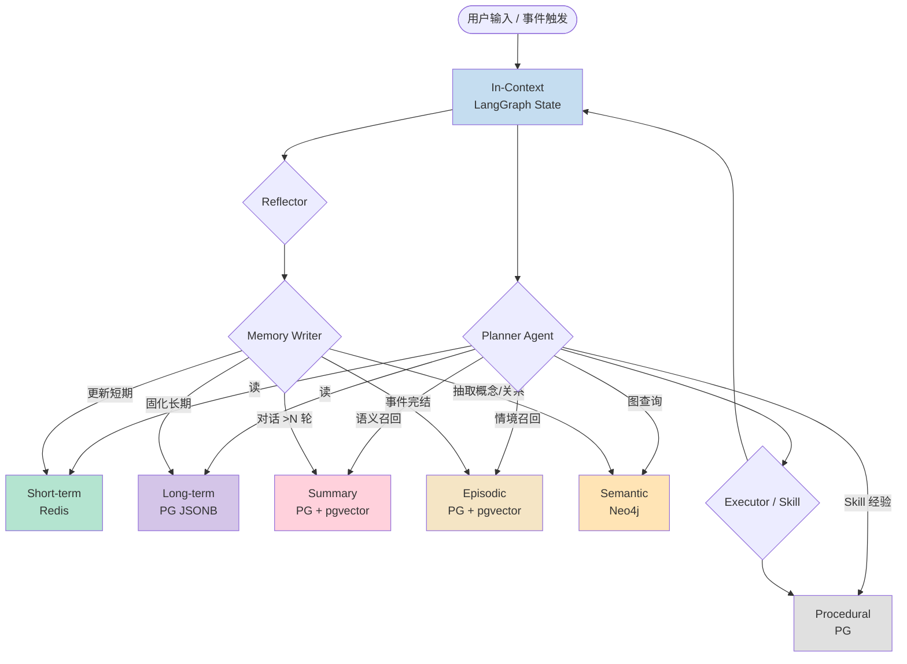

# LumiPath 7-Layer Cognitive Memory 规范

> Step 1 产出 · 定义 Agent 的 7 种记忆机制、存储介质、读写规则与数据流转。
> 版本：v1.0 (2026-04-21)

---

## 1. 为什么要 7 层记忆？

传统 LLM Agent 的"记忆"只有 In-Context（单次对话窗口），导致：
- 跨会话失忆 → 用户反复教
- Token 窗口 blow-up → 成本与延迟激增
- 无法结构化学习 → 经验不沉淀

LumiPath 借鉴 **CoALA**（Cognitive Architectures for Language Agents, Sumers et al. 2023）与 **MemGPT / Letta** 的分层思想，针对个人成长场景定制出 7 层模型：

| 层 | 时效 | 对应人类记忆 | 定位 |
|---|------|------------|------|
| In-Context | 秒级 | 工作记忆 | 当前对话 |
| Short-term | 小时/日 | 近期记忆 | 今日面试/OKR 状态 |
| Long-term | 永久 | 自传记忆 | 职业画像、能力模型 |
| Summary | 永久 | 压缩记忆 | 长对话/已完结面试摘要 |
| Episodic | 永久 | 情景记忆 | 某次面试的完整情境 |
| Semantic | 永久 | 语义记忆 | 知识图谱 |
| Procedural | 永久 | 程序记忆 | Skill 执行经验 |

---

## 2. 存储介质矩阵

| 记忆 | 主存储 | 副存储 | 读延迟目标 | 典型大小 |
|------|--------|--------|----------|---------|
| In-Context | LangGraph State (内存) | — | < 1ms | 8–32 KB / turn |
| Short-term | Redis Hash + SortedSet | — | < 5ms | < 512 KB / user |
| Long-term | PostgreSQL JSONB | — | < 20ms | < 128 KB / user |
| Summary | PostgreSQL + pgvector | — | < 50ms (向量召回) | 1–5 KB / summary |
| Episodic | PostgreSQL + pgvector | Vault `.md` 副本 | < 50ms | 5–30 KB / episode |
| Semantic | Neo4j | pgvector 辅助 | < 30ms Cypher | 节点/边数按用户增长 |
| Procedural | PostgreSQL `memory_procedures` | — | < 20ms | < 100 KB / skill |

---

## 3. 记忆整体数据流



---

## 4. 各层详细规范

### 4.1 In-Context Memory（工作记忆）

**定位**：当前 LangGraph 执行流中的状态字典，随调用栈存在。

**结构**：
```python
class AgentState(TypedDict):
    messages: list[BaseMessage]         # 对话消息
    user_id: UUID
    session_id: UUID
    scratchpad: dict                    # 中间推理草稿
    retrieved: dict                     # 本轮从其他层召回的上下文
    token_budget: int                   # 剩余 token 预算
```

**读写**：
- LangGraph 每个节点自动 merge state。
- 节点读 `state["retrieved"]` 决策。

**Token 预算策略**：
- 触发 Summary 的阈值：当 `messages` token > 6000 或 turn 数 > 20。
- 保留最近 3 轮原始，其余压缩为 Summary 注入。
- 系统消息中 retrieved memory 最多占 2000 token（加权裁剪）。

---

### 4.2 Short-term Memory（近期状态）

**定位**：用户近 24h 内的操作快照与高频访问数据，加速 Agent 冷启动。

**Redis Key 设计**：

| Key | 类型 | 内容 | TTL |
|-----|------|-----|-----|
| `st:user:{uid}:today_okr` | Hash | 今日待办 KR 完成情况 | 24h |
| `st:user:{uid}:recent_interviews` | List | 最近 7 天面试列表 | 24h |
| `st:user:{uid}:active_note` | String | 当前正在编辑的笔记路径 | 6h |
| `st:user:{uid}:mood` | String | 今日情绪标签（来自笔记 frontmatter） | 24h |
| `st:user:{uid}:focus_tags` | ZSet | 近期高频标签（score=次数） | 24h |

**读写规则**：
- Agent 启动时一次性拉取全部 Short-term（Redis pipeline）。
- 用户 HTTP 操作（保存笔记、打卡 KR）后立即更新 ST。
- TTL 到期由后续访问触发 regenerate（不做定时刷新）。

**防击穿**：regenerate 时加分布式锁 `lock:st:{uid}:{key}`，逻辑过期。

---

### 4.3 Long-term Memory（长期画像）

**定位**：从高频短期行为固化下来的、描述用户本人的稳定属性。

**PG 表**：`memory_long_term`（详见 [database-schema.md](database-schema.md)）

**JSONB 字段示例**：
```json
{
  "profile": {
    "target_roles": ["后端工程师", "AI 工程师"],
    "target_companies_tier": ["T0", "T1"],
    "years_of_experience": 3,
    "primary_stack": ["Python", "Go", "PostgreSQL"]
  },
  "ability_model": {
    "algorithm": { "score": 7.2, "evidence_count": 45 },
    "system_design": { "score": 6.5, "evidence_count": 23 },
    "redis": { "score": 8.1, "evidence_count": 12 }
  },
  "preferences": {
    "tone": "concise",
    "language": "zh-CN",
    "note_style": "bullet"
  }
}
```

**更新策略**：
- Reflector 节点在会话结束时判断"是否有稳定信号"，有则调用 `upsert_long_term`。
- 能力分：EMA（指数加权平均），新证据 weight = 0.1，避免波动。
- 每次更新写入 `memory_long_term_history`（审计表）保留 diff。

---

### 4.4 Summary Memory（压缩摘要）

**定位**：对长对话、已完结面试流程的语义压缩，节省 token。

**触发时机**：
1. In-Context token 超阈值 → 压缩较早消息。
2. 面试状态变为 `completed`/`rejected`/`offered` → 生成流程摘要。
3. 每周五夜里 Celery beat → 生成本周笔记周报。

**Summary 生成 Prompt 模板**（示意，实际在 Step 2 编码）：
```
你是一位精炼复述助手。请将以下内容压缩为 ≤ 300 字的摘要，
保留：关键决策、异常信号、用户情绪、时间线。删除寒暄与重复。

原文：{content}
```

**存储**：`memory_summaries`（text + embedding vector(1536)），关联 `source_type` + `source_id`。

**召回**：Planner 用 query embedding 做 `<->` 相似度，取 top-k=3。

---

### 4.5 Episodic Memory（情景记忆）

**定位**：一次"有边界的事件"的完整快照。最典型的 episode 是**一场面试**或**一场深度自省对话**。

**何时生成 episode**：
- 面试状态机走到终态。
- Agent 对话被用户标记为"重要复盘"。
- 单日情绪波动显著（对比 long-term 均值）。

**存储**：`memory_episodes`

**字段**：
```
id, user_id, title, occurred_at, duration_min,
context (JSONB),     # 地点、公司、面试官、情绪…
narrative (TEXT),    # 第一人称叙事
embedding (vector),  # 整段叙事 embedding
linked_notes (UUID[]),
linked_interview_id
```

**召回方式**：
- 相似情境：`WHERE occurred_at > now() - 90 days ORDER BY embedding <-> query_emb LIMIT 5`
- 指定类型：`WHERE context->>'company' = 'ByteDance'`

---

### 4.6 Semantic Memory（语义记忆 / 个人知识图谱）

**定位**：用户掌握的**概念、技能、公司、题目**及其关系网。可支撑 GraphRAG 查询。

**Neo4j Schema**：

```cypher
// 节点
(:User {id, email})
(:Concept {name, category, canonical_name})    // "Redis RDB"、"动态规划"
(:Skill {name, canonical_name})                // "Python"、"系统设计"
(:Company {name, tier})
(:Question {id, text, difficulty})
(:Tag {name})

// 边
(:User)-[:MASTERED {score, last_reviewed}]->(:Concept)
(:User)-[:PRACTICED {times, last_at}]->(:Skill)
(:User)-[:INTERVIEWED_AT {round, result, date}]->(:Company)
(:Question)-[:ASKED_IN {date}]->(:Company)
(:Question)-[:RELATES_TO]->(:Concept)
(:Concept)-[:PREREQ_OF]->(:Concept)
(:Concept)-[:BELONGS_TO]->(:Skill)
(:Note)-[:MENTIONS]->(:Concept)
```

**写入时机**：
- 笔记保存后从 `#tag` + 正文抽概念（Celery worker）。
- 面试题目标注时写 `(:Question)-[:ASKED_IN]->(:Company)`。
- 复盘完成后更新 `MASTERED.score`。

**典型 GraphRAG 查询**：
```cypher
// "跟字节二面相关的、我还没掌握的 Redis 概念"
MATCH (u:User {id: $uid})
MATCH (c:Company {name: "ByteDance"})<-[:INTERVIEWED_AT {round: 2}]-(u)
MATCH (q:Question)-[:ASKED_IN]->(c)
MATCH (q)-[:RELATES_TO]->(concept:Concept)
MATCH (concept)-[:BELONGS_TO]->(:Skill {canonical_name: "Redis"})
OPTIONAL MATCH (u)-[m:MASTERED]->(concept)
WHERE m IS NULL OR m.score < 6
RETURN concept.name, m.score
```

---

### 4.7 Procedural Memory（程序记忆 / Skill 经验）

**定位**：Agent 执行某个 Skill 的成功/失败经验，用于下次选型与参数优化。

**PG 表**：`memory_procedures`

**字段**：
```
id, user_id, skill_name, input (JSONB), output (JSONB),
success (BOOL), latency_ms, tokens_used, cost_usd,
error (TEXT NULL), executed_at,
review (TEXT NULL)         # Reflector 对这次执行的点评
```

**用途**：
- Planner 决策时：`WHERE skill_name = $X AND success = true ORDER BY executed_at DESC LIMIT 5` → 参考成功参数。
- 自动改进：聚合失败模式（TOP-5 报错），下次 prompt 注入"避坑提示"。
- 成本控制：每日统计 token/cost 超阈值告警。

---

## 5. 记忆整合（Consolidation）

| 触发 | 动作 |
|------|------|
| Short-term → Long-term | Celery beat 每日 02:00：扫 ST 中过去 30 天持续出现的信号 → 写 LT |
| Conversation → Summary | LangGraph `reflector` 节点：turn > 20 或 token > 6000 |
| Interview 完结 → Episodic | 状态机钩子：interview.status 变为终态时 Celery 发事件 |
| Note → Semantic | 笔记 upsert 后异步：`#tag` 和 `[[wiki]]` → Neo4j MERGE |
| Skill 执行 → Procedural | LangGraph `executor` 节点后置钩子，无条件写 |

---

## 6. 检索融合（Retrieval Fusion）

Planner 往往需要同时召回多层记忆。采用 **Reciprocal Rank Fusion (RRF)**：

```
final_score(doc) = Σ_source  1 / (k + rank_in_source(doc))
```

三路并行召回：
1. Summary 向量 Top-5
2. Episodic 向量 Top-5
3. Semantic Cypher Top-5（按 `MASTERED.score` 或路径距离）

RRF 融合后取 Top-8 注入 In-Context。LT 与 Short-term 作为"背景常量"单独拼接。

---

## 7. 隐私与"遗忘"

- 用户可在设置中选择"忘记该条记忆"：软删 `deleted_at` + 置向量为 null + Neo4j 断边。
- 敏感笔记（frontmatter `private: true`）不进向量 / 不进 Neo4j，仅文件保留。
- 可配置遗忘曲线：`memory_episodes` 超 365 天且无引用时，Celery beat 压缩为 Summary 并归档原文。

---

## 8. 与外部 MCP 的契合

- MCP Server 暴露工具 `recall_memory(query, types=[...])`，外部 Obsidian 插件可直接调 → 让 Obsidian 内任意位置调用"LumiPath，帮我召回相似的面试情景"。
- MCP 工具 `write_memory(type, content, tags)` 让外部 Agent 主动往 LumiPath 沉淀经验。

---

## 9. 实现顺序（Step 2 指引）

1. `BaseMemory` 抽象基类（read / write / search）。
2. 7 个子类骨架（先空实现 + 单测桩）。
3. `MemoryManager` 统一门面（含 RRF）。
4. LangGraph 的 `retriever` 和 `memory_writer` 节点接入。
5. 整合测试：一次端到端 session 验证 7 层全部被读/写至少一次。

---

## 10. 相关文档

- [architecture.md](architecture.md) — 系统架构图
- [notes-vault-spec.md](notes-vault-spec.md) — 笔记 vault 与 Semantic Memory 的关系
- [database-schema.md](database-schema.md) — PG 记忆表完整 DDL
