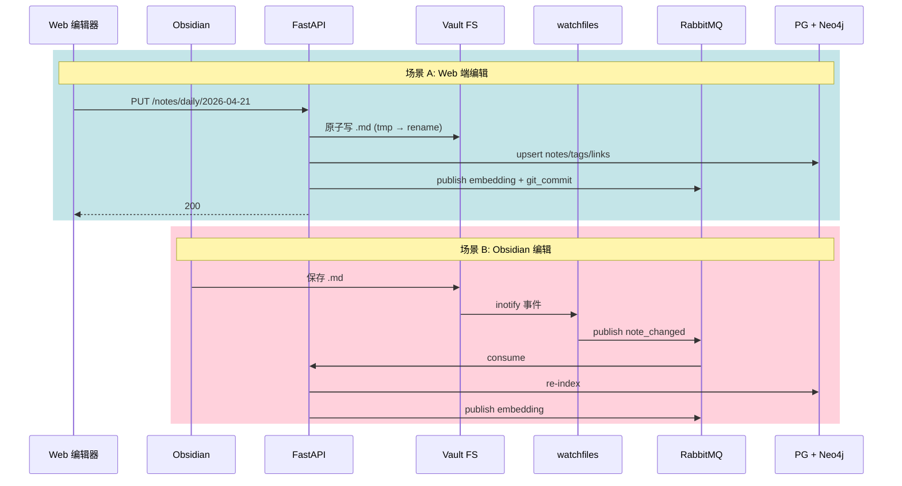

# LumiPath Notes Vault 规范

> Step 1 产出 · 定义 Markdown 笔记的目录约定、Frontmatter 规范、双向同步、Git 版本化、CLI 工具、Obsidian 互通。
> 版本：v1.0 (2026-04-21)

---

## 1. 设计原则

1. **文件即真相（File as Source of Truth）**：`.md` 文件是主数据，DB 只是索引。断电断网、LumiPath 死掉，用户的数据仍在。
2. **Obsidian-first**：Frontmatter + `[[wikilink]]` + `#tag` 完全兼容 Obsidian 默认语法。
3. **Git-native**：vault 本身是 Git 仓库，每次变更自动 commit，可 push 到 GitHub/GitLab/Gitea。
4. **跨设备同步**：通过 Git 远端实现多设备 vault 同步，无需额外同步协议。
5. **Agent 可读可写**：Agent 读/写笔记就是读/写 `.md`，无私有格式。

---

## 2. 目录约定

```
vault/
└── {user_id}/                          ← 每个用户一个子仓库（单租户简化版：vault 即用户根）
    ├── .git/                           ← Git 仓库
    ├── .lumipath/                      ← 系统元数据（不同步到 Obsidian）
    │   ├── config.yml                  ← vault 级配置
    │   └── sync.log
    ├── .gitignore
    ├── .obsidian/                      ← Obsidian 配置（可选，用户自管）
    ├── README.md                       ← vault 说明
    ├── daily/                          ← 每日学习笔记
    │   ├── 2026-04-21.md
    │   └── 2026-04-22.md
    ├── weekly/                         ← 周总结（Agent 自动生成）
    │   └── 2026-W17.md
    ├── monthly/                        ← 月总结
    │   └── 2026-04.md
    ├── interviews/                     ← 面试复盘（AI 生成 + 用户编辑）
    │   ├── bytedance-r2-2026-03-15.md
    │   └── meituan-r1-2026-03-20.md
    ├── okr/                            ← OKR 季报
    │   ├── 2026-Q1-review.md
    │   └── 2026-Q2-plan.md
    ├── concepts/                       ← 用户整理的概念卡片（Zettelkasten 风）
    │   ├── redis-rdb-vs-aof.md
    │   └── dynamic-programming-basics.md
    ├── companies/                      ← 公司档案
    │   └── bytedance.md
    ├── templates/                      ← 模板（可被用户改）
    │   ├── daily-note.md
    │   ├── interview-review.md
    │   ├── okr-quarterly.md
    │   └── concept-card.md
    └── attachments/                    ← 图片 / 附件
        └── 2026-04-21-diagram.png
```

### 2.1 文件命名规则

| 类型 | 规则 | 示例 |
|------|------|------|
| 日记 | `YYYY-MM-DD.md` | `2026-04-21.md` |
| 周报 | `YYYY-Www.md`（ISO 周） | `2026-W17.md` |
| 月报 | `YYYY-MM.md` | `2026-04.md` |
| 面试复盘 | `{company-slug}-r{round}-YYYY-MM-DD.md` | `bytedance-r2-2026-03-15.md` |
| OKR | `YYYY-Q{n}-{plan\|review}.md` | `2026-Q2-plan.md` |
| 概念卡 | `{kebab-case-title}.md` | `redis-rdb-vs-aof.md` |
| 公司档案 | `{company-slug}.md` | `bytedance.md` |

- Slug：小写 + 连字符；中文公司名保留原文（Obsidian 支持）：`字节跳动.md` 亦合法。
- 禁用字符：`\ / : * ? " < > |`（Windows 保留）。
- UTF-8 BOM-free。

---

## 3. Frontmatter 规范（YAML）

每个 `.md` 文件顶部必含 YAML Frontmatter（`---` 包裹）。未识别字段保留不报错。

### 3.1 通用字段（所有类型）

| 字段 | 类型 | 必填 | 说明 |
|------|------|-----|------|
| `id` | UUID | 推荐 | 系统生成（未填则按路径生成稳定 UUID） |
| `title` | string | 推荐 | 展示标题（缺省取 H1） |
| `type` | enum | **必填** | `daily` / `weekly` / `monthly` / `interview` / `okr` / `concept` / `company` / `free` |
| `created_at` | ISO8601 | 自动 | 首次创建时间 |
| `updated_at` | ISO8601 | 自动 | 最近更新 |
| `tags` | list[str] | 可选 | `[算法, 系统设计]`（也可正文用 `#tag`） |
| `private` | bool | 可选 | `true` 时不进向量库、不进 Neo4j |
| `lang` | string | 可选 | `zh-CN` / `en-US` / `mixed` |

### 3.2 `type: daily` 专用字段

| 字段 | 类型 | 说明 |
|------|------|------|
| `date` | `YYYY-MM-DD` | 日期（必填） |
| `mood` | enum | `focused` / `tired` / `anxious` / `excited` / `calm` |
| `energy` | int (1-10) | 精力值 |
| `related_interviews` | list[UUID] | 关联面试 ID |
| `related_okr` | list[UUID] | 关联 KR ID |
| `linked_questions` | list[UUID] | 关联题目 |

### 3.3 `type: interview` 专用字段

| 字段 | 类型 | 说明 |
|------|------|------|
| `company` | string | 公司名 |
| `role` | string | 岗位 |
| `round` | int | 轮次 |
| `interview_date` | `YYYY-MM-DD` | 面试日期 |
| `duration_min` | int | 时长 |
| `result` | enum | `pending` / `passed` / `failed` / `offer` / `rejected` |
| `questions` | list[UUID] | 关联题目 |
| `interviewer_style` | string | 面试官风格（可选） |

### 3.4 `type: okr` 专用字段

| 字段 | 类型 | 说明 |
|------|------|------|
| `quarter` | `YYYY-Q{n}` | 季度 |
| `kind` | enum | `plan` / `review` |
| `objectives` | list[UUID] | 目标 ID |
| `overall_score` | float (0-1) | 季度完成度 |

### 3.5 `type: concept` 专用字段

| 字段 | 类型 | 说明 |
|------|------|------|
| `concept` | string | 概念名（权威名） |
| `category` | string | 归属技能（Redis / 算法 / 系统设计） |
| `mastery` | int (1-5) | 掌握度自评 |
| `prereqs` | list[string] | 前置概念 |

---

## 4. 内链与标签

### 4.1 Wikilink `[[...]]`
- 基本形式：`[[redis-rdb-vs-aof]]`（按 slug 匹配）。
- 带显示文本：`[[redis-rdb-vs-aof|RDB vs AOF]]`。
- 锚点：`[[2026-Q2-plan#KR-3]]`。
- 后端解析：建 `note_links(source_note_id, target_note_id, anchor)` 双向索引。
- 断链：目标不存在时 `note_links.target_note_id = NULL`，前端红色高亮。

### 4.2 标签 `#tag`
- 正文中 `#算法` `#redis/持久化` 均识别（支持层级）。
- 写入 `note_tags` 表。
- Neo4j 同步：`(:Note)-[:TAGGED]->(:Tag {name})`，同时 `Tag → Concept` 的抽取由 Celery worker 完成（LLM 判断是否升格为 Concept 节点）。

### 4.3 题目引用 `!q:{uuid}`（LumiPath 扩展语法）
- 在笔记中引用面试题库里的某道题：`!q:01HXYZ...`。
- 渲染时前端查 DB 展开为题目卡片；Obsidian 原生不识别，显示原文不会乱。

---

## 5. 日记模板（默认）

路径：`templates/daily-note.md`

```markdown
---
type: daily
date: {{date}}
title: "{{date}} 学习日志"
mood: focused
energy: 7
tags: []
related_interviews: []
related_okr: []
---

# {{date}} 学习日志

## 🎯 今日目标
- [ ]
- [ ]
- [ ]

## 📚 学习内容


## 🧠 复盘
### 做得好的

### 待改进

### 关键洞察

## 🔗 关联
- 面试:
- OKR:
- 概念:

## 💡 明日计划
- [ ]
```

> 模板变量（`{{date}}` 等）由后端在创建时渲染，使用 Jinja2 子集。

---

## 6. 面试复盘模板

路径：`templates/interview-review.md`

```markdown
---
type: interview
company: "{{company}}"
role: "{{role}}"
round: {{round}}
interview_date: {{date}}
duration_min: 60
result: pending
questions: []
tags: [面试, "{{company}}"]
---

# {{company}} · 第 {{round}} 轮 · {{date}}

## 基本信息
- 岗位：{{role}}
- 时长：
- 面试官：
- 形式：电话 / 视频 / 现场

## 题目复盘
### 题 1：{{title}}
**原题**：
**我的回答**：
**标准思路**：
**差距**：

## 自我评价
- 做得好：
- 不足：
- 情绪状态：

## AI 分析（自动生成区域，请勿编辑）
<!-- LUMIPATH:AI_REVIEW_START -->
<!-- LUMIPATH:AI_REVIEW_END -->

## 下一步
- [ ]
```

> AI 生成区域用 HTML 注释锚点分隔，Agent 重写时只替换该块，保留用户手写内容。

---

## 7. OKR 季报模板

路径：`templates/okr-quarterly.md`

```markdown
---
type: okr
quarter: "{{quarter}}"
kind: plan
objectives: []
overall_score: 0
tags: [okr]
---

# {{quarter}} OKR

## O1: <目标描述>
**动机**：
**成功画面**：

### KR 1.1
- 指标：
- 基线 → 目标：
- 里程碑：

### KR 1.2

## O2: ...

## 风险与依赖
```

---

## 8. 双向同步流程



### 8.1 写入原子性

Web 端保存流程：
1. 写 `2026-04-21.md.tmp`
2. fsync
3. rename 为正式名（原子）
4. 更新 DB
5. 发 RabbitMQ 事件

任何中断：
- 步骤 1–2 中断 → 只剩 `.tmp`，启动时清理。
- 步骤 3 后中断 → 文件 OK，后台补索引（通过 checksum 对比）。

### 8.2 冲突解决

规则：
- `file.mtime > db.last_synced_at + 2s` 且 `db.version` 也被改 → 冲突。
- 冲突处理：
  1. 保存 `.conflict-{timestamp}.md` 副本。
  2. 主文件取 **mtime 更晚** 的版本。
  3. 后台通知用户（前端通知中心 + 邮件）并在 DB `conflicts` 表落账。
  4. 用户可在 Web 端查看 diff 并手动 merge。

---

## 9. Git 版本化

### 9.1 提交策略

| 事件 | 提交行为 | Commit Message 模板 |
|------|---------|---------------------|
| Web 保存笔记 | 立即 celery 异步 commit（防抖 10s 合并同笔记多次编辑） | `note({type}): {path} updated` |
| Obsidian 改文件 | watchfiles 触发后延迟 30s 合并 commit | `sync({source}): {count} files changed` |
| Agent 生成周报 | 立即 commit | `ai(weekly): {YYYY-Www} generated` |
| AI 生成面试复盘 | 立即 commit | `ai(interview): {company}-r{round} generated` |
| 用户手动 `lumipath push` | 打 tag 并 push | — |

### 9.2 分支策略

- 单分支 `main`：个人 vault，简单至上。
- 可选 `ai/*` 分支：重度 AI 编辑时先进 `ai/generation-{ts}`，用户确认后 merge 到 main（给"不信任 AI 的用户"一个审查门）。默认关闭。

### 9.3 远端同步

- 用户在设置页填 Git 远端 URL + SSH Key（或 Personal Access Token）。
- 凭据加密存储（PG，使用 Fernet + 应用级密钥 KMS）。
- push 失败告警：RabbitMQ → notify 队列 → 前端通知 + 邮件。
- 拉取：每日 beat `git fetch` + `git merge --ff-only`，非 ff 触发冲突流程（第 8.2 节）。

### 9.4 .gitignore 默认

```
.lumipath/sync.log
.obsidian/workspace*
.obsidian/cache
*.conflict-*.md
.DS_Store
Thumbs.db
```

---

## 10. lumipath CLI

Python Click，入口 `lumipath`。

| 命令 | 说明 |
|------|------|
| `lumipath init` | 在当前目录初始化 vault（含 git init、模板、.gitignore） |
| `lumipath login [--sso google]` | 登录 LumiPath 后端并保存 token |
| `lumipath link <vault-path>` | 把本地 vault 路径注册到 LumiPath 后端 |
| `lumipath sync` | 拉取远端 git + 推送本地变更 + 触发后端 reindex |
| `lumipath push` | 仅推送 |
| `lumipath pull` | 仅拉取 |
| `lumipath new daily [--date YYYY-MM-DD]` | 按模板新建日记 |
| `lumipath new interview --company X --round 2` | 新建面试复盘 |
| `lumipath review <file>` | 让 AI 对该笔记做复盘（流式输出到终端） |
| `lumipath search "query"` | 语义检索本人全部笔记 |
| `lumipath export --type interview --since 2026-01-01 --format json` | 导出 |
| `lumipath doctor` | 自检：git 状态、远端连通性、后端 token 有效性、vault 目录健康 |

### 10.1 DevOps 场景

CI 自动化：
```yaml
# .github/workflows/lumipath-sync.yml
on:
  schedule: [{ cron: "0 20 * * *" }]  # 每日 20:00 UTC
  workflow_dispatch:
jobs:
  sync:
    runs-on: ubuntu-latest
    steps:
      - uses: actions/checkout@v4
      - run: pipx install lumipath-cli
      - run: lumipath login --token ${{ secrets.LUMIPATH_TOKEN }}
      - run: lumipath sync
```

---

## 11. Obsidian 插件互通

LumiPath 提供 **Obsidian 官方插件**（Plugin），通过 MCP 协议与本地/远端 LumiPath 后端通信：

| 插件功能 | MCP 工具调用 |
|---------|------------|
| 命令面板："LumiPath: 召回相似笔记" | `recall_memory(query, types=[episodic,summary])` |
| 命令面板："LumiPath: 让 AI 复盘本文件" | `review_note(path)` |
| 右键菜单："提取为概念卡" | `extract_concept(note_path)` |
| 侧边栏："今日 OKR 状态" | `get_today_okr(user_id)` |
| 保存后自动触发后端 reindex | `reindex_note(path)` |

配置：用户在 Obsidian 设置里填后端地址 + Token，即可打通。

---

## 12. 导出（面试/OKR → vault）

Celery worker `vault_sync` 监听事件：
- `interview.review.generated` → 渲染 `interview-review.md` 模板 → 写 `interviews/{slug}.md` → git commit。
- `okr.quarterly.generated` → 渲染 `okr-quarterly.md` → 写 `okr/`。

保证：
- 覆盖写时 AI 只改 `<!-- LUMIPATH:AI_* -->` 注释块内，用户手写部分不丢。
- 覆盖前先 `git diff` 校验，若 diff > 阈值要求人工确认（前端弹提示）。

---

## 13. 安全

| 方面 | 方案 |
|------|------|
| 多用户隔离 | 每个 user 的 vault 是独立目录 + 独立 git repo；FastAPI 层 `owner_id` 强校验 |
| 敏感笔记 | Frontmatter `private: true` → 不进向量库、不进 Neo4j、Git commit 正常但可配置加密子目录 |
| 加密子目录 | `vault/{uid}/vault-encrypted/` 使用 age 加密（可选，默认关闭） |
| Git 凭据 | Fernet 加密存 DB，应用启动时从环境变量/KMS 加载 master key |
| 审计 | 所有 vault 写操作进 `events` 表 |

---

## 14. 下一步（Step 2 指引）

- `services/notes_service.py`：Markdown 读写 + frontmatter 解析 + wikilink 抽取。
- `services/vault_sync.py`：watchfiles 监听 + Git 操作（GitPython 或 pygit2）。
- `workers/vault_watcher.py`：Celery 消费 watchfiles 事件。
- `workers/embedding_worker.py`：笔记切块 + embedding + pgvector 写入。
- `cli/lumipath.py`：Click 入口，先实现 `init / sync / new daily`。

---

## 15. 相关文档

- [architecture.md](architecture.md)
- [memory-system.md](memory-system.md) — 笔记如何驱动 Semantic / Episodic Memory
- [database-schema.md](database-schema.md) — `notes` / `note_tags` / `note_links` / `note_embeddings` DDL
